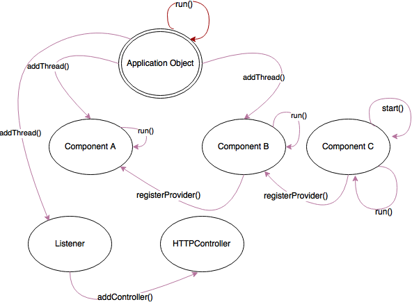

Application Lifeycle
#####################
This chapter will describe the application lifecycle of the oZone framework, from init->run->termination.

Summary
**************

At a conceptual level, initializing the oZone framework involves:

* Initializing the debug/logging subsystem
* Initializing various audio/video handlers to manage streams/decoding/encoding
* Instantiating an :code:`Application` object to manage application lifecycle
* Instantiating various components per your need
* Registering various components with each other to establish a workflow
* Adding all components to the :code:`Application` object so they can be started
* Invoke the :code:`Application` object's :code:`run()` method

    
    A high level view of the application lifecycle

The :code:`Application` object can be thought of as the master object that keeps track of all the components. When components are instantiated, they register with the :code:`Application` object by invoking its :code:`addThread()` method. This essentially adds the object to the :code:`Application` queue. 

When you invoke the :code:`Application` :code:`run()` method, it iterates through the list of components and invokes the :code:`start()` methof of each object, which essentially launches a thread for each component. Following this, it invokes the :code:`run()` method of each component, which is what is expected to be the entry point of each component's functionality. 

Note that the :code:`Application` object is just a convenience. You can easily invoke the :code:`start()` method of each component yourelf. The latter approach is typically useful when you dynamically create new components and remove them after you start the application.

The :code:`Listerner` and :code:`HTTPController` components are used when you need to convert the frames of a component into a browser viewable version. :code:`Listerner` along with :code:`HTTPController` are an easy way to create MJPEG images which you can display on the browser with a simple :code:`` tag. 

.. sidebar::  Summary of oZone framework lifecycle

    * Initialize debug and AV subsystems
    * Create components
    * connect them via :code:`registerProvider()`
    * add each component to Application object via :code:`addThread()`
    * To render frames to browsers, instantiate Listerner and HttpController object
    * Invoke :code:`app.run()`

More details
*********************

Application Life Cycle Manager
==============================
The :code:`Application` object is really very simple. It's `implementation <https://github.com/ozonesecurity/ozonebase/blob/master/server/src/base/ozApp.cpp>`_ simply keeps a list of components. Components are added to the :code:`Application` object by invoking its `addThread()` method which simply pushes a pointer to the component into its internal queue.

Once you connect all the components to the :code:`Application` object, and you invoke the :code:`run()` method, all it really does is iterate through the list and invoke the `run()` method of each component *in a new thread* (yes, each component **must** have a run method) and then waits for them to terminate.

Component Chaining
==================
We also talked about how components could chain to each other to create workflows. Chaining is achieved by invoking a :code:`registerProvider` method of a component. 

Here is a live example:

.. code-block:: c++
   :linenos:

    Application app;

    AVInput input( "input", "http://kxhcm10/nphMotionJpeg?Resolution=640x480&Quality=Standard");
    app.addThread( &input );

    FaceDetector detector( "detector" );
    detector.registerProvider( input );
    app.addThread( &detector );

    VideoParms videoParms( 320, 240 );
    AudioParms audioParms;
    MovieFileOutput movie( detector.cname(), "/transfer", "mp4", 60, videoParms, audioParms );
    output2.registerProvider( detector );
    app.addThread( &movie );

    app.run();

Explanation:

* line 1 - create Application object (app)
* line 3-4: create a provider component (input) that reads video feeds from a URL and add it to the application object
* line 6 - create a FaceDetector processor component (detector)
* line 7 - register the provider component of line 3 (input) to be the frame provider for this new face detector component
* line 8 - also add this facedetector component to the master Application object (app)
* line 10-12: instantiate a consumer component that will create video files (movie)
* line 13: register the provider component of movie to be the facedetector component
* line 14: add this output component to the master Application object (app)

.. note:: What just happened?  

    - input will read frames from that URL
    - detector will attempt to detect faces in the frames input provides above
    - movie will attempt to create video files which will essentially be the same frames generated by input, but overlayed with face detection markers detector creates

* line 16: launch all the threads and have fun!
