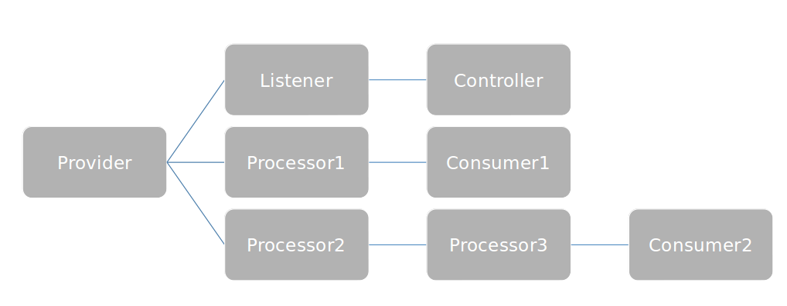
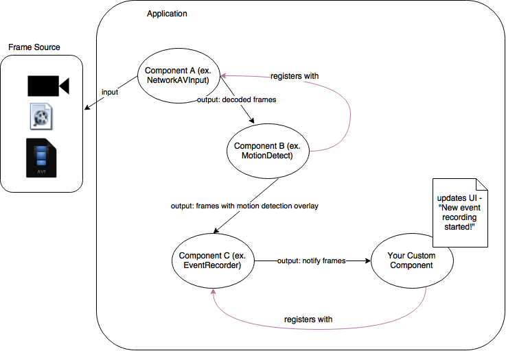

Key Architecture Principles
****************************

Frames
=======
oZone centers around the concept of passing Frames between Components. A 'Frame' is really just an abstract concept. Common types of frames may be:

* A **video frame** - a special type of frame that contains one frame of a video stream
* An **audio frame** - a special type of frame that contains one frame of audio from a video/audio stream
* A **data frame** - may contain any kind of data
* A **notification frame** - this is really a type of data frame, but its important to bring this out as it serves a specific purpose - an ability of one  component to notify another component (if it is interested) of an event of interest. 

.. sidebar:: Key Concepts Summary

    * Each Component serves a specific purpose
    * Components can register with each other
    * Components pass "Frames" around to registered components
    * Each Component runs in its own thread

Components
===========
Now that we understand the core data structure of inter-component-communication, lets understand what "Components" are.

Components are cohesive objects that serve specific functions. Specific to the purpose of oZone, examples of components are:

* A component that can read audio/video frames from a camera
* A component that can perform motion detection from the 'frames' received from the component above (see how chaining works?)
* A component that can record motion frames to disk when a defined threshold of movement is detected? (Example, only store frames that involve people moving around, not your cats or dogs. Again, see how we keep chaining components?)

Types of Components
-------------------
Given that components are a critical part of oZone, lets talk about the types of components you can use.

.. sidebar:: Components Types Summary

    * A Provider generates frames (typically audio/video)
    * A Consumer consumes these frames for some purpose
    * A Process both consumes frames from upstream components and generate frames for downstream components

* Providers
* Consumers
* Processors
* Listeners
* Controllers

A **Provider** is a type of component that "generates" frames. A perfect example of a Provider is `AVInput <http://ozone.network/apidocs/class_a_v_input.html>`_, which is able to connect to a source like :code:`/dev/video0` for a local webcam, :code:`/path/to/file/fulldayrecording.mp4` for a recorded video, or, :code:`rtsp://myliveurl` for a RTSP camera. It can connect to *any* such input source and produces audio and/or video frame, completely abstracting the nature of the source for other components down the chain.

A **Consumer** is a type of component that "consumes" frames. Unlike a Provider, it doesn't generate any frames, so there is no point "registering" for frames with a consumer. A good example of a Consumer is `EventRecorder <http://ozone.network/apidocs/class_event_recorder.html>`_, that writes motion events to disk.

.. note:: It's not totally true that consumers don't generate frames. An exception is that it can generate notification frames - example, when you want to notify a downstream component that a new event is about to be written to disk (maybe you want to update your UI)

A **Processor** is really a hybrid between a Provider and a Consumer. A Processor accepts frames and generates frames. Can you think of an example for this? `MotionDetector <http://ozone.network/apidocs/class_motion_detector.html>`_ is a good example! It typically 'registers' with a Provider, analyzes the frames and outputs then overlayed with motion information for further downstream processing. Or take for example, the uber awesome `MatrixVideo <http://ozone.network/apidocs/class_matrix_video.html>`_ processor which accepts frames from N components and creates a configurable NxM matrix of frames stitched together and outputs it as a single frame for downstream display!

Finally, **Listeners** and **Controllers** are somewhat specialized in its purpose. A Listener listens for data. A Listener connects to a Controller that controls what needs to be done when the listener receives data. For example, `HttpController <http://ozone.network/apidocs/class_http_controller.html>`_ is a controller that can be attached to a listener like so:

::

    HttpController httpController( "watch", 9292 );
    httpController.addStream("watchcam1",cam1);
 
This bit of code would allow for browsers to connect to port 9292 and render the output of a camera feed as MJPEG, automagically. 

   An abstract view of  application linking components

    An application specific instance of chaining components

